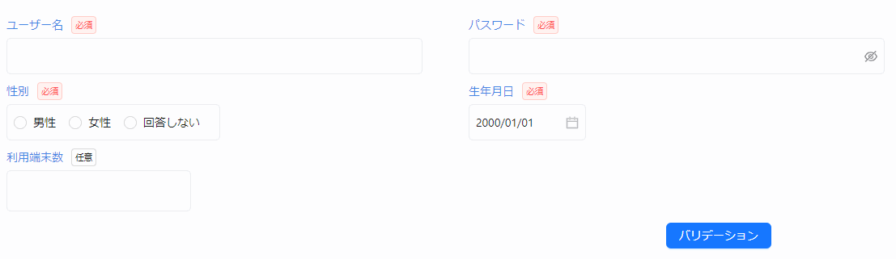

Item を初期化するために使用する `useCsXxxItem` の第三引数に、バリデーションルールを設定できます。

```tsx
useCsXxxItem(..., ..., バリデーションルール, ...);
```

## 標準ルールを使ってバリデーションを定義する

バリデーションルールを設定する際は、省力化コンポーネントが提供するバリデーションルールメソッドを使用します。  
以下の表に示すように、入力項目の値の種類に応じた 5 つのバリデーションルールメソッドを使用できます。

| ルールメソッド    | 対象項目                       | 例                                     |
| ----------------- | ------------------------------ | -------------------------------------- |
| `stringRule`      | 値を文字列で管理する項目       | テキスト入力ボックス、セレクトボックス |
| `numberRule`      | 値を数値で管理する項目         | 数値入力ボックス                       |
| `stringArrayRule` | 値を文字列の配列で管理する項目 | チェックボックス（複数選択）           |
| `numberArrayRule` | 値を数値の配列で管理する項目   | チェックボックス（複数選択）           |
| `booleanRule`     | 値を真偽値で管理する項目       | チェックボックス （単一選択）          |

バリデーションルールメソッドの基本的なシグネチャは以下の通りです。（※詳細については[リファレンス](../../category/リファレンス)を参照してください。）

```tsx
xxxRule(必須指定, 最小値*¹, 最大値*¹, カスタムバリデーションルール*²)

※1 最小値と最大値は stringRule と numberRule のみ設定可能です
※2 カスタムバリデーションルールについては次項で解説します
```

前節で定義した入力項目に対して設定されているバリデーションルールは以下の表の通りです。

```tsx title="前節で定義した画面項目"
const useRegisterUserView = (): RegisterUserView => {
  return useCsView({
    userName: useCsInputTextItem(
      "ユーザー名",
      useInit(""),
      stringRule(true, 3, 30)
    ),
    password: useCsInputPasswordItem(
      "パスワード",
      useInit(""),
      stringRule(true, 8, 16)
    ),
    gender: useCsRadioBoxItem(
      "性別",
      useInit(""),
      stringRule(true),
      selectOptionStrings(["男性", "女性", "回答しない"])
    ),
    birthDay: useCsInputDateItem(
      "生年月日",
      useInit("2000-01-01"),
      stringRule(true)
    ),
    terminalNum: useCsInputNumberItem(
      "利用端末数",
      useInit(),
      numberRule(false, 1, 10)
    ),
  });
};
```

| 項目名     | バリデーションルール                    |
| ---------- | --------------------------------------- |
| ユーザー名 | 入力必須、3 文字以上 30 文字以下        |
| パスワード | 入力必須、8 文字以上 16 文字以下        |
| 性別       | 入力必須                                |
| 生年月日   | 入力必須                                |
| 利用端末数 | 入力任意、入力する場合は 1 以上 10 以下 |

## カスタムルールを使ってバリデーションを定義する

標準のバリデーションルールに加えて、独自のカスタムバリデーションルールを定義もしくは使用できます。これにより、特定のビジネスロジックや要件に応じた柔軟なバリデーションを実現できます。

:::info
新しくカスタムバリデーションルールを作る方法については、拡張ガイドを参照してください。  
ここでは、既に作成済みのカスタムバリデーションルールを使用する方法についてのみ解説します。
:::

省力化コンポーネントでは、使用頻度の高いカスタムバリデーションルールを `buildInCustomValidationRules` として提供しています。`buildInCustomValidationRules` に含まれるカスタムバリデーションルールの一覧は[リファレンス](../../category/リファレンス)を参照してください。

カスタムバリデーションルールを使用するためには、`useCsView` の第二引数にカスタムバリデーションルールオブジェクトを指定する必要があります。

```tsx title="カスタムバリデーションルールを使用する"
import { buildInCustomValidationRules } from "@/framework/validation-rules";

return useCsView(
  {
    userName: useCsInputTextItem(
      "ユーザー名",
      useInit(""),
      stringRule(true, 3, 30)
    ),
    // (...他の画面項目定義...)
  },
  {
    // カスタムバリデーションルールオブジェクトを指定
    customValidationRules: buildInCustomValidationRules,
  }
);
```

カスタムバリデーションルールオブジェクトは、以下のようにルール名（キー）とルールメソッド（バリュー）のセットで定義されます。

```tsx
export const buildInCustomValidationRules = {
  半角数字: stringRule(
    createRegExpValidator(/^\d*$/),
    (label: string, _: string) => "半角数字で入力してください。"
  ),
  半角英字: stringRule(
    createRegExpValidator(/^[a-zA-Z]*$/),
    (label: string, _: string) => "半角英字で入力してください。"
  ),
  半角英数字: stringRule(
    createRegExpValidator(/^[a-zA-Z0-9]*$/),
    (label: string, _: string) => "半角英数字で入力してください。"
  ),
  // (...省略...)
};
```

カスタムバリデーションルールを使用する場合は、使用したいルールのルール名（キー）を、`useCsXxxItem` の中で使用しているバリデーションルールメソッドの第四引数に指定してください。

```tsx title="カスタムバリデーションルールのキーを指定する"
return useCsView(
  {
    userName: useCsInputTextItem(
      "ユーザー名",
      useInit(""),
      // ルールメソッドの第四引数にカスタムバリデーションルールのキーを指定
      stringRule(true, 3, 30, "半角英数字")
    ),
    // (...他の画面項目定義...)
  },
  {
    customValidationRules: buildInCustomValidationRules,
  }
);
```

## バリデーションの実施方法

バリデーションを実施する方法として以下の 2 つがあります。

- ボタン押下時にバリデーションを実施する
- 入力フォームのフォーカスアウト時にバリデーションを自動で実施する

※上記の 2 つは併用できます。

### ボタン押下時にバリデーションを実施する

省力化コンポーネントが提供するボタン部品を使用することで、ボタン押下時にバリデーションを実施できます。
`validationViews` という Props に、バリデーション対象の View の変数を指定します。

```tsx title="ボタン押下でバリデーションを実施する"
// 対象画面の View を初期化する
const view = useRegisterUserView();

return (
  {/* Ant Design を想定して Ax から始まるボタン部品を使用 */}
  <AxButton validationViews={[view]}>
    バリデーション実行
  </AxButton>
)
```



### 入力フォームのフォーカスアウト時にバリデーションを自動で実施する

`useCsView` の第二引数に `validationTrigger: "onBlur"` を指定することで、各入力フォームのフォーカスが外れたタイミングでバリデーションを実施できます。

```tsx
return useCsView(
  {
    userName: useCsInputTextItem(
      "ユーザー名",
      useInit(""),
      stringRule(true, 3, 30)
    ),
    // (...他の画面項目定義...)
  },
  {
    validationTrigger: "onBlur",
  }
);
```


