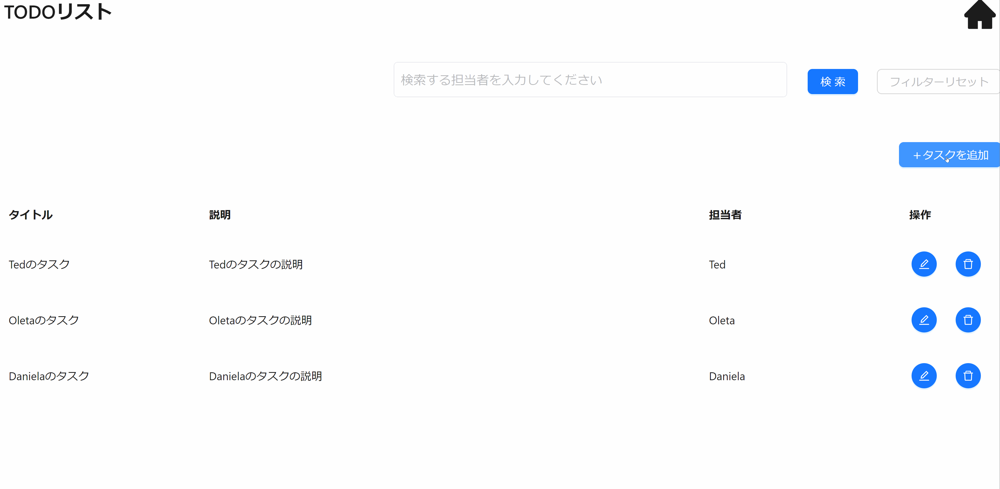

本節ではいかに示すような登録機能の実装方法について説明します。



## イベントの型を定義する

登録機能のイベントの型定義には`CsMutateButtonClickEvent`を指定します。登録用の View（`TodoCreateView`）のプロパティにイベントの型を定義します。型パラメータには 登録 API のリクエスト、レスポンスの型を指定します。

```ts title="src/app/todo/page.view.ts"
// Orvalで自動生成されたTodoRegistrationの型定義をimport

/**
 * 登録用のViewの型定義
 */
export type TodoCreateView = CsView & {
  title: CsInputTextItem;
  description: CsTextAreaItem;
  assignee: CsInputTextItem;
  // highlight-start
  createButton: CsMutateButtonClickEvent<
    // APIのリクエストデータ型を定義
    {
      data: TodoRegistration; // TodoRegistration型を定義
    },
    Todo // APIのレスポンスデータ型を定義
  >;
  // highlight-end
};
```

## イベントを初期化する

登録用の View（`TodoCreateView`）にイベントの初期化処理を追加します。登録 API では Event のフックに`useCsRqMutateButtonClickEvent()`、引数には Orval で自動生成された API フック`usePutTodo()`を指定します。

```ts title="src/app/todo/page.view.ts"
// Orvalで自動生成されたAPIフック（usePutTodo）をimport

/**
 * 登録用のViewの初期化
 *
 * @returns TodoPostView 登録用のView
 */
export const useTodoCreateView = (): TodoCreateView => {
  return useCsView({
    title: useCsInputTextItem("タイトル", useInit(""), stringRule(true, 1, 20), RW.Editable, "タイトルを入力してください"),
    description: useCsTextAreaItem("説明", useInit(""), stringRule(true, 1, 100), RW.Editable, "タスクの説明を入力してください"),
    assignee: useCsInputTextItem("担当者", useInit(""), stringRule(true, 1, 20), RW.Editable, "担当者を入力してください"),
    // highlight-start
    createButton: useCsRqAdvancedMutateButtonClickEvent(usePostTodo()), // イベントの初期化処理の追加
    // highlight-end
  });
};
```

### View の定義を呼び出す

[イベントの初期化](./create-feature.md#イベントを初期化する)で定義した 登録用の View 定義を呼び出します。

```tsx title="src/app/todo/TodoCreateModal.tsx"
const todoPostView = useTodoCreateView(); // 登録用のViewの呼び出し
```

## ボタンを配置する

登録 API に対応する`AxMutateButton`を配置します。`event`引数にはボタン押下時に実施したいイベント（`createButton`）を指定します。`validationViews`にはバリデーションを実施したい画面単位（`todoCreateView`）を配列型で指定します。

```tsx title="src/app/todo/TodoCreateModal.tsx"
/**
 * 登録用のModal定義
 */
<Modal
  open={isOpenCreateModal}
  title="追加"
  onCancel={onCancel}
  footer={
    <AxMutateButton event={todoPostView.createButton} validationViews={[todoPostView]} type="primary" onAfterApiCallSuccess={onAfterApiCallSuccess}>
      作成
    </AxMutateButton>
  }
>
  <>
    <AxInputText item={todoPostView.title}></AxInputText>
    <AxTextArea item={todoPostView.description}></AxTextArea>
    <AxInputText item={todoPostView.assignee}></AxInputText>
  </>
</Modal>
```

## 登録 API に必要なリクエストを設定する

登録 API 呼び出し時に指定する API リクエストを指定します。`data`には登録するデータを指定します。

```tsx title="src/app/todo/TodoCreateModal.tsx"
const todoPostView = useTodoCreateView(); // 登録用のViewの呼び出し

// highlight-start
todoPostView.createButton.setRequest({
  // リクエストデータに値をセット
  data: {
    title: todoPostView.title.value ?? "",
    description: todoPostView.description.value ?? "",
    assignee: todoPostView.assignee.value ?? "",
  },
});
// highlight-end
```

以上で、登録機能の実装が完了します。ボタン押下時に登録 API が呼び出されているか確認してください。
