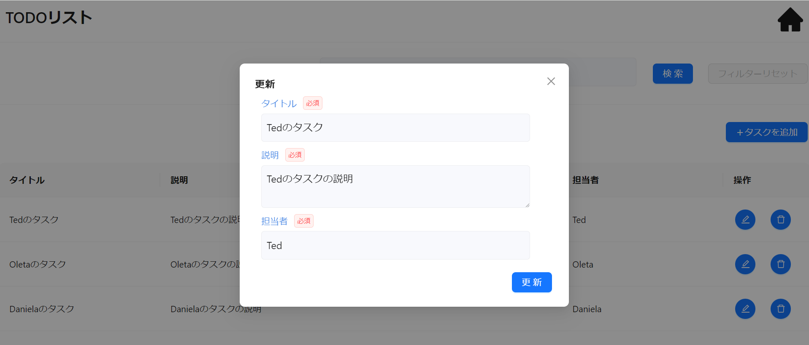

本節では以下に示すような更新機能の実装方法について説明します。



## イベントの型を定義する

更新機能のイベントの型定義には`CsMutateButtonClickEvent`を指定します。更新用の View（`TodoEditView`）の型にイベントの型を定義します。型パラメータには API リクエスト、API レスポンス型を指定します。

`app/todo/page.view.ts`ファイルで以下のようなコードを記述します。

```tsx title="app/todo/page.view.ts"
// Orvalで自動生成されたTodoRegistrationの型定義をimport

/**
 * 更新用のViewの型定義
 */
type TodoEditView = CsView & {
  title: CsInputTextItem;
  description: CsTextAreaItem;
  id: CsInputTextItem; // 更新対象を識別するためのID
  // highlight-start
  updateButton: CsMutateButtonClickEvent<
    // 更新対象のId、APIのレスポンスデータ型を定義
    {
      todoId: string;
      data: TodoRegistration; // TodoRegistration型を定義
    },
    Todo // APIのレスポンスデータ型を定義
  >;
  // highlight-end
};
```

## イベントを初期化する

更新用の View（`TodoEditView`）の初期化にイベントの初期化処理を追加します。更新 API では Event のフックに`useCsRqMutateButtonClickEvent()`、引数には Orval で自動生成された API フック`useEditUserInfo()`を指定します。

`app/todo/page.view.ts`ファイルで以下のようなコードを記述します。

```tsx title="app/todo/page.view.ts"
// Orvalで自動生成されたAPIフック（useEditUserInfo）をimport

/**
 * 更新用のViewの初期化
 */
export const useTodoEditView = (): TodoEditView => {
  return useCsView({
    title: useCsInputTextItem(
      "タイトル",
      useInit(""),
      stringRule(true, 1, 20),
      RW.Editable
    ),
    description: useCsTextAreaItem(
      "説明",
      useInit(""),
      stringRule(true, 1, 100),
      RW.Editable
    ),
    // 更新対象を識別するためのID（表示はしない）
    id: useCsInputTextItem("ID", useInit(""), stringRule(false), RW.Editable),
    // highlight-start
    updateButton: useCsRqAdvancedMutateButtonClickEvent(useEditUserInfo()), // イベントの初期化処理の追加
    // highlight-end
  });
};
```

## View 定義を呼び出す

[イベントの初期化](./crud-update.md#イベントの初期化)で定義した 更新用の View 定義を呼び出します。

`app/todo/page.tsx`ファイルで以下のようなコードを記述します。

```tsx title="todo/page.ts"
const todoEditView = useTodoEditView(); // 更新用のViewの呼び出し
```

## 取得 API で取得した値を更新画面の初期値に渡す

固定の文字列などを用いて View に初期値を渡すには`useInit`を指定します。ただし、取得 API のような非同期で取得される値を渡す場合には`setValue`を使用します。

`app/todo/page.tsx`ファイルで指定した値をセットする方法について記述します。

```tsx title="todo/page.ts"
const openModal = (mode: "create" | "edit" | "delete", record?: Todo) => {
  switch (mode) {
    case "create":
      setIsOpenCreate(true);
      break;
    case "edit":
      // highlight-start
      todoPutView.id.setValue(record?.id);
      todoPutView.title.setValue(record?.title);
      todoPutView.description.setValue(record?.description);
      todoPutView.assignee.setValue(record?.assignee);
      // highlight-end
      setIsOpenEdit(true);
      break;
    case "delete":
      todoDeleteView.id.setValue(record?.id);
      setIsOpenDelete(true);
      break;
    default:
      break;
  }
};
```

## ボタンを配置する

更新 API に対応する`AxMutateButton`を配置します。`event`引数にはボタン押下時に実施したいイベント（`updateButton`）を指定します。`validationViews`にはバリデーションを実施したい画面単位（`todoEditView`）を配列型で指定します。

`app/todo/page.tsx`ファイルで以下のようなコードを記述します。

```tsx title="todo/page.ts"
/**
 * 更新用のModal定義
 */
<Modal
  open={isOpenEdit}
  title="更新"
  onCancel={() => {
    closeModal("edit");
  }}
  footer={null}
>
  <>
    <AxInputText item={todoEditView.title}></AxInputText>
    <AxTextArea item={todoEditView.description}></AxTextArea>
    // highlight-start
    <AxMutateButton
      event={todoEditView.updateButton}
      validationViews={[todoEditView]}
      type="primary"
      onAfterApiCallSuccess={() => {
        closeModal("edit");
      }}
    >
      更新
    </AxMutateButton>
    // highlight-end
  </>
</Modal>
```

## 更新 API に必要なリクエストを設定する

更新 API 呼び出し時に指定する API リクエストを指定します。`todoId`には更新対象の Id、`data`には更新するデータを指定します。

`app/todo/page.tsx`ファイルで以下のようなコードを記述します。

```tsx title="todo/page.ts"
todoEditView.updateButton.setRequest({
  // リクエストデータに値をセット
  todoId: todoEditView.id,
  data: {
    title: todoEditView.title.value ?? "",
    description: todoEditView.description.value ?? "",
  },
});
```

以上の実装により、更新機能 の実装が完了します。ボタン押下時に適切に更新 API が呼び出されているか確認してください。
