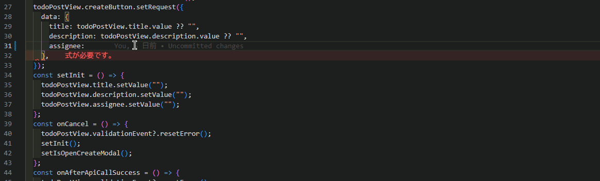

## 対応するイベントやバリデーションは一つの View に定義しましょう

バリデーション、`AxTableLayout`の自動レイアウトや isLoading などの処理は View の単位で処理されます。そのため対応するフィールドごとに View を定義する必要があります。
また、View という名前空間があるため Item や Event の自動補完が効くというメリットもあります。

以下に良い実装例、悪い実装例を示します。<br />

### ❌ 対応する Event と Item を別々の View で定義しない

```tsx
export type InputTodoView = CsView & {
  title: CsInputTextItem;
  description: CsTextAreaItem;
  assignee: CsInputTextItem;
};

export const useInputTodoView = (): InputTodoView => {
  return useCsView({
    title: useCsInputTextItem(
      "タイトル",
      useInit(""),
      stringRule(true, 1, 20),
      RW.Editable,
      "タイトルを入力してください",
    ),
    description: useCsTextAreaItem(
      "説明",
      useInit(""),
      stringRule(true, 1, 100),
      RW.Editable,
      "タスクの説明を入力してください",
    ),
    assignee: useCsInputTextItem(
      "担当者",
      useInit(""),
      stringRule(true, 1, 20),
      RW.Editable,
      "担当者を入力してください",
    ),
  });
};

export type TodoCreateView = CsView & {
  createButton: CsMutateButtonClickEvent<
    {
      data: TodoRegistration;
    },
    Todo
  >;
};

export const useTodoCreateView = (): TodoCreateView => {
    createButton: useCsRqAdvancedMutateButtonClickEvent(usePostTodo()),
}
```

### ✅ 対応するフィールドでひとつの View を定義する

```tsx
export type TodoCreateView = CsView & {
  title: CsInputTextItem;
  description: CsTextAreaItem;
  assignee: CsInputTextItem;
  createButton: CsMutateButtonClickEvent<
    {
      data: TodoRegistration;
    },
    Todo
  >;
};

export const useTodoCreateView = (): TodoCreateView => {
  return useCsView({
    title: useCsInputTextItem(
      "タイトル",
      useInit(""),
      stringRule(true, 1, 20),
      RW.Editable,
      "タイトルを入力してください",
    ),
    description: useCsTextAreaItem(
      "説明",
      useInit(""),
      stringRule(true, 1, 100),
      RW.Editable,
      "タスクの説明を入力してください",
    ),
    assignee: useCsInputTextItem(
      "担当者",
      useInit(""),
      stringRule(true, 1, 20),
      RW.Editable,
      "担当者を入力してください",
    ),
    createButton: useCsRqAdvancedMutateButtonClickEvent(usePostTodo()),
  });
};
```


