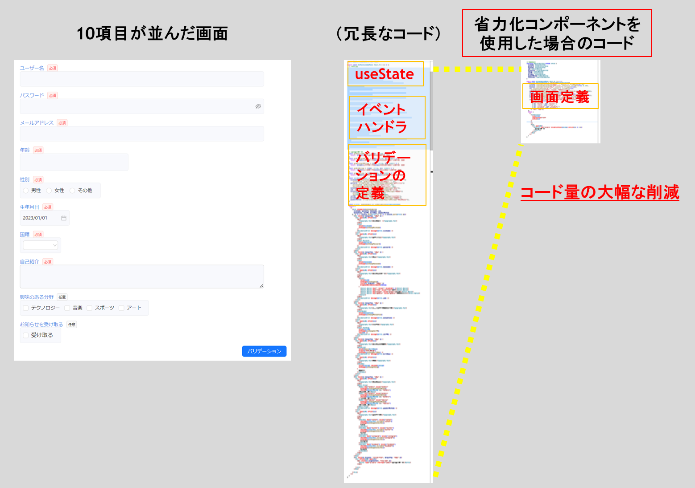

# はじめに

このコンテンツでは、 React で画面開発を行う際の生産性を向上させる[省力化コンポーネント](省力化コンポーネントを知るへのリンク)について解説します。

省力化コンポーネントは、次に示す 3 つの[特徴](省力化コンポーネントを知る>特徴へのリンク)を持ちます。

- <strong>画面項目の定義が 1~2 行で書ける </strong>
  - 画面項目に関連する情報を 1 箇所に集約することで、記述量を減らすことができる
- <strong>バリデーションの定義が簡潔に書ける </strong>
  - スキーマ定義を記述することなくバリデーションの定義が簡潔に書ける
- <strong>高機能なボタンを提供する </strong>
  - API 呼び出しやバリデーション実行などの機能を搭載したスマートなボタンを提供する

React で 10 個の入力項目が並んだ画面を開発する場合を考えてみましょう。  
下の図は、従来の React を用いて実装を行った場合と、本コンテンツで紹介する省力化コンポーネントを用いて実装を行った場合のコード量の比較を示しています。この図から分かるように、省力化コンポーネントを用いた場合、上記に示した 3 つの特徴により従来の<strong> 約 30% ～ 40%</strong>のコード量で同様の画面を実装することができます。
このように、省力化コンポーネントを用いることで、画面項目定義やバリデーション定義のためのコード記述量を削減し、開発の生産性を向上させることができます。また、冗長なコードを排除することにより、メンテナンス性の高いコードベースを維持することが可能となります。

:::note information
省力化コンポーネントを導入する場合は[こちら](導入ガイドへのリンク)
:::
