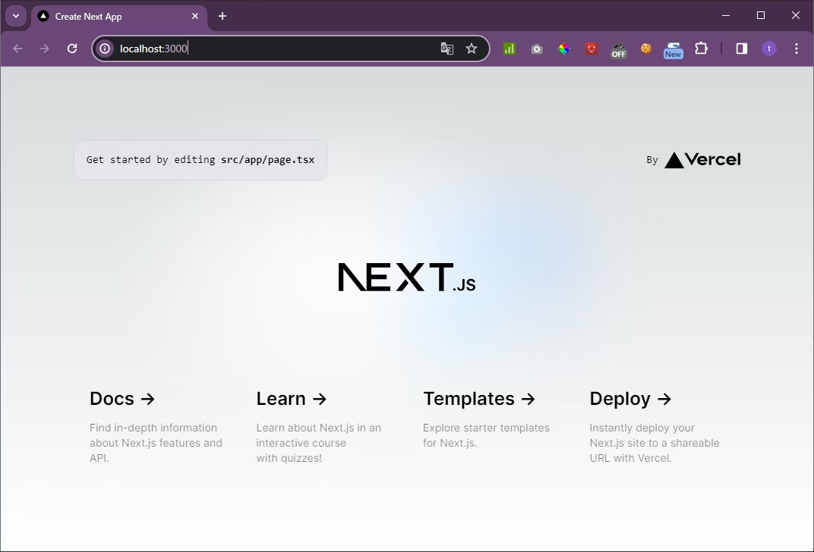

# 事前準備

:::warning 導入ガイドを読む前に
[導入指標](../know-cs-component/introduction-index.md)を読んでいない人は、まずそちらを読んでください。
導入指標と自身のシステムを照らし合わせた結果、導入を決めた場合にのみこの先を読んでください。
:::

本章では省力化コンポーネントをご自身のプロジェクトに導入するための手順を解説していきます。まず事前準備として、Next.Js プロジェクトの作成と、導入ツールのダウンロードを行ってください。

## Next.js プロジェクトの作成

:::warning Next.js プロジェクトがある場合
既に Next.js プロジェクトがある場合は、 ##導入ツールのダウンロードに進んでください。
:::
本ドキュメントでは、省力化コンポーネントを使用するアプリケーション基盤として Next.js を使用するケースについて解説します。Next.js は、React をベースにしたフレームワークであり、サーバーサイドレンダリングや静的サイト生成を簡単に実現するための強力なツールを提供します。

:::info Next.js について知らない場合
Next.js を初めて使う方には、以下の学習リソースをお勧めします。

- Next.js 公式ドキュメント：公式のドキュメントは、Next.js の基本から応用までをカバーしています。
- Next.js チュートリアル：公式サイトにあるインタラクティブなチュートリアルで、実際にコードを書きながら学ぶことができます。
- YouTube - Next.js Crash Course：YouTube には多くの Next.js のチュートリアル動画があり、視覚的に学びたい方に最適です。

:::

Next.js プロジェクトを新規に作るには、ターミナルで次のコマンドを実行してください。

```Terminal:Terminal
npx create-next-app@latest
```

コマンド実行後、各設定を聞かれますので Yes か No を選択していってください。以下に示すのは、本ドキュメントが推奨する各設定です。

```Terminal:Terminal
√ Would you like to use TypeScript? ... Yes
√ Would you like to use ESLint? ... Yes
√ Would you like to use Tailwind CSS? ... Yes
√ Would you like to use `src/` directory? ... Yes
√ Would you like to use App Router? (recommended) ... Yes
√ Would you like to customize the default import alias (@/*)? ... No
```

プロジェクトの作成が完了したら、作成されたディレクトリに移動し、次のコマンドを実行してください。

```Terminal:Terminal
npm run dev
```

http://localhost:3000 にアクセスをし、以下のような画面が表示されれば成功です。



## 導入ツールのダウンロード

省力化コンポーネントの資材をインストールするためのツールが、GitHub の dev-react-cs-component リポジトリに格納されています。

Git をインストールしている場合は、以下のコマンドでリポジトリをクローンしてください。

```Terminal:Terminal
$ git clone https://github.com/Fintan-contents/dev-react-cs-component.git
```

Git をインストールしていない、もしくは使わない場合は、以下のリンクから zip ファイルをダウンロードし、任意の場所に解凍してください。  
[GitHub から zip ファイルをダウンロード](../intro.md)
