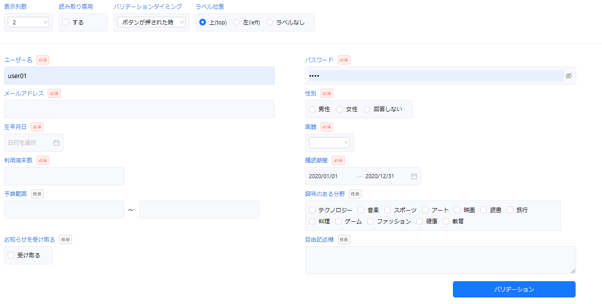

# 導入後の作業

省力化コンポーネントの資材がインストールできたら、必要に応じて以下の作業を行ってください。

- デモ画面の表示
- Orval の設定

## デモ画面の表示

:::warning
デモ画面を含めるかの選択で「いいえ」を選択した方はこの作業を実施する必要がありません。
:::

プロジェクトのルートディレクトリに移動し、次のコマンドを実行してください。

```bash title="Terminal"
npm run dev
```

http://localhost:3000/demo にアクセスし、以下のような画面が表示されれば成功です。



:::info
上記のデモ画面は、UI コンポーネントライブラリに 「Ant Design」 を選択した場合のイメージ図です。
:::

:::warning 
デモ画面の中で、省力化コンポーネント部品の import 元が正しく設定されていない可能性があります。以下のファイルの import 文を確認し、エラーが出ている場合は正しいパスに設定し直してください。

- `app/demo/DemoXxxHeader.tsx` (Xxx は選択した UI コンポーネントライブラリ名)
- `app/demo/DemoXxxMain.tsx`
  :::

## Orval の設定

:::warning

API 呼び出し方式の選択で「TanStack Query」を選択した方はこの作業を実施する必要がありません
:::

Orval を用いて OpenAPI 仕様からコードを自動生成するための設定手順について解説をします。  
設定手順は以下の 4 ステップです。

1. OpenAPI の定義ファイルを配置する
2. Axios のカスタムインスタンスを作成する
3. orval.config.ts を作成する
4. コードを自動生成する

### 1. OpenAPI の定義ファイルを配置する

OpenAPI 仕様が定義された `oepnapi.yml` を配置します。

```
プロジェクトのルート
　　|- openapi
　　　　|- openapi.yml　※配置場所はあくまで一例です
　　|- ...
```

:::info 
省力化コンポーネントのサンプルアプリで使用している OpenAPI 仕様は[こちら](https://github.com/Fintan-contents/dev-react-cs-component)。  
:::

### 2. Axios のカスタムインスタンスを作成する

Orval に設定するための Axios のカスタムインスタンスを作成します。
カスタムインスタンスを作成することで、API リクエストに必要な共通設定を一元化することができます。

```
プロジェクトのルート
　　|- src
　　　　|- libs
　　　　　　|- backend
　　　　　　　　|- customInstance.ts　※配置場所はあくまで一例です
```

カスタムインスタンスの作成方法は[Custom instance(公式サイト)](https://orval.dev/guides/custom-axios#custom-instance)を参考にしてください。

:::info 
省力化コンポーネントのサンプルアプリで使用しているカスタムインスタンスは[こちら](https://github.com/Fintan-contents/dev-react-cs-component)。  
:::

### 3. orval.config.ts を作成する

`orval.config.ts` という Orval の設定ファイルをルート直下に作成します。

```
プロジェクトのルート
　　|- orval.config.ts
　　|- ...
```

設定ファイルに記述する内容は[Configuration(公式サイト)](https://orval.dev/reference/configuration/overview)を参考にしてください。  
最低限設定する必要がある項目は `input` と `output` です。

- [input](https://orval.dev/reference/configuration/input)：参照元の OpenAPI 仕様
- [output](https://orval.dev/reference/configuration/output)：自動生成されるコードに関する設定  
  ※ `mutator` には、手順 2 で作成したカスタムインスタンスを設定してください。

:::info 
省力化コンポーネントのサンプルアプリで使用している設定ファイルは[こちら](https://github.com/Fintan-contents/dev-react-cs-component)。
:::

### 4. コードを自動生成する

1 ～ 3 の設定を行うことで、Orval を利用したコードの自動生成が行えるようになります。  
まず、 `package.json` に以下の定義を追記してください。

```js title="package.json"
{
  ...
  "scripts": {
    ...
    "code-gen": "npx orval --config ./orval.config.ts"
  },
  ...
}
```

次に、ターミナルで以下のコマンドを実行してください。実行後、手順 3 で `output` の中に指定した出力先にソースコードが自動生成されます。

```bash title="Terminal"
npm run code-gen
```

以上で、Orval の設定は完了です。  
自動生成されたコードを用いて実際に API を呼び出す方法については、[CRUD 機能の実装](../implementation-guide/crud-function-implementation.md)を参照してください。
